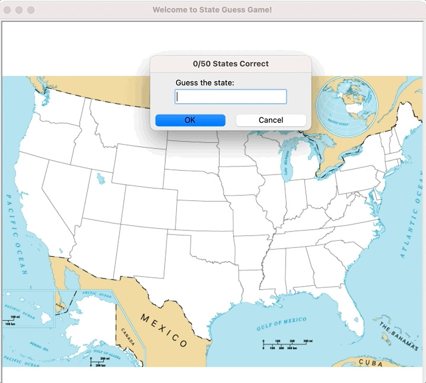

<a name="readme-top"></a>


<div align="center">
<!-- Title: -->
<h1><a href="https://github.com/skthati/Guess-the-state/">Guess the State</a> - Python Turtle </h1>
</div>

<!-- Table of contents -->
<hr>
<hr>
<ol>
    <li><a href="#guess-state">Guess the State in USA</a></li>
    <li><a href="#bloopers">Bloopers</a></li>
</ol>
<hr>
<hr>


# Guess the state

 Guess the states from USA, Using python Turtle.
 * User input the state name
 * Check if state is present
 * If correct, increase the score.


The same logic can be implemented to many other game or knowledge ideas.


Code
```Python
import pandas
import random
from turtle import Turtle, Screen

# Using pandas read csv file.
data = pandas.read_csv("50_states.csv")
# d1 = data[data["state"] == "Texas"]
# if d1.x == -38:
#     print("Weldone!")


# Instance of Turle and Screen Class.
# t = Turtle

s = Screen()

# Global variable declaration
game_state = True
count = 0

# Background image of USA
s.bgpic("blank_states_img.gif")
# s.register_shape("blank_states_img.gif")
# t.shape("blank_states_img.gif")
# Title of window.
s.title("Welcome to State Guess Game!")

while game_state:
    # Text input.
    user_input = s.textinput(f"{count}/50 States Correct", "Guess the state: ")
    # print(user_input)

    # Pull State Series and convert to List.
    row_in_data = data["state"].to_list()
    row_lst = data[data["state"] == user_input]
    # print(str(row_lst.state))
    if row_lst.state.item() == user_input:
        count += 1
        t = Turtle()
        t.penup()
        t.hideturtle()
        t.goto(int(row_lst.x), int(row_lst.y))
        t.pendown()
        t.write(row_lst.state.item())
        # t.write(user_input)
    # row_lst = list(row_lst)
    # print(row_lst)

s.mainloop()


```

Output



<p align="right">(<a href="#readme-top">back to top</a>)</p>
<hr>  

 ## Bloopers <a name="bloopers"></a>

 <!--
```Python

``` 
-->
<!-- 

Test1  
## Test <a name="test"></a>
Test Test

1. Code
    ```Python
    sc.onkey(key="Up", fun=up_move)
    sc.onkey(key="Right", fun=right_move)
    sc.onkey(key="Left", fun=left_move)
    sc.onkey(key="Down", fun=down_move)
    ```

2. Output

    

<p align="right">(<a href="#readme-top">back to top</a>)</p>
<hr>  


-->
